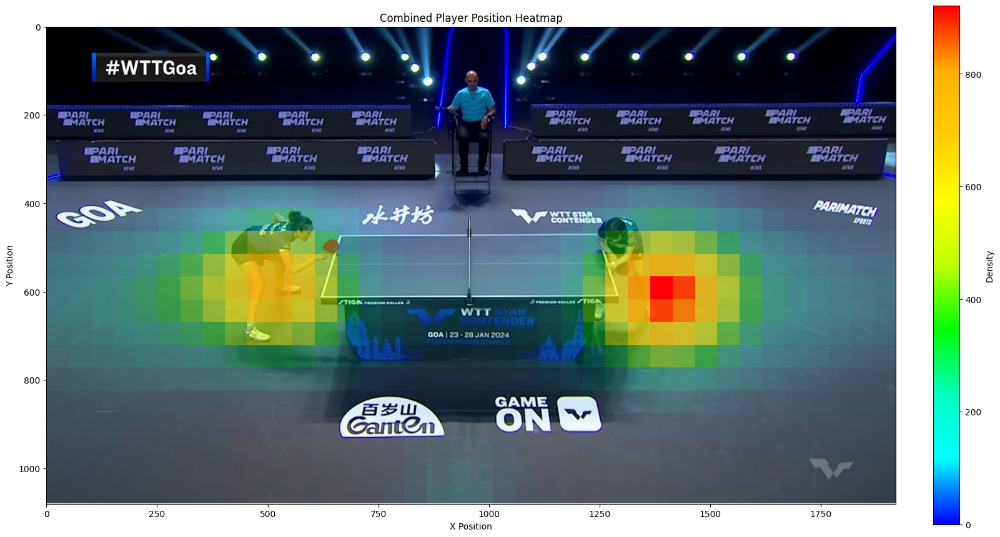

Download the input video from here:
https://drive.google.com/file/d/1Cl0THtGExrQwwfNQp7cK6ncYIQy09QJE/view?usp=sharing


# Table Tennis Match Analyzer


A comprehensive computer vision project that automatically analyzes table tennis match footage to extract player positions, track skeletons, recognize the score, and generate insightful data visualizations. This project demonstrates a multi-faceted approach to video analysis, combining object detection, pose estimation, and optical character recognition (OCR).

---

## Project Showcase

Below are examples of the key outputs generated by the analysis pipeline.

|                       Output Type                       | Description                                                                                                                                              |
| :-----------------------------------------------------: | -------------------------------------------------------------------------------------------------------------------------------------------------------- |
|                   **Detection Video**                   | The original video is processed to overlay player bounding boxes and skeletal keypoints, providing a visual representation of the tracking in real-time. |
|    )     | _(This is a placeholder image. The actual output is `output_with_detections.mp4`)_                                                                       |
|               **Player Position Heatmap**               | A heatmap is generated from the players' court positions throughout the match, revealing patterns of movement and strategic positioning.                 |
|  |                                                                                                                                                          |
|               **Score Progression Plot**                | A time-series plot illustrates the score changes for each player over the duration of the video, providing a clear narrative of the match's progression. |
|            |                                                                                                                                                          |

---

## Key Features

- **Player Detection & Pose Estimation**: Utilizes a YOLOv11-pose model to accurately detect players and estimate their 17-point skeletal structure in each frame.
- **Robust Score Recognition**: Implements a sophisticated, dual-strategy OCR system:
  - **Primary Method**: Employs `easyocr` after applying a battery of advanced image preprocessing techniques (resizing, thresholding, edge enhancement, dilation) to maximize recognition accuracy.
  - **Fallback Method**: If OCR confidence is low, the system automatically switches to template matching against pre-defined digit images for enhanced reliability.
- **Intelligent Frame Filtering**: The system intelligently identifies and processes only the frames containing active gameplay, discarding irrelevant shots (e.g., crowd pans, close-ups) to ensure data quality.
- **Data Logging**: Systematically logs key data points to CSV files for further analysis:
  - `player_positions.csv`: Frame-by-frame `(x, y)` coordinates of each player.
  - `frame_scores.csv`: Scores at regular intervals throughout the video.
- **Automated Data Visualization**: Automatically generates a suite of insightful visualizations upon completion of the analysis.

---

## Technical Stack

- **Core Language**: Python
- **Computer Vision**: OpenCV
- **Object Detection & Pose Estimation**: Ultralytics YOLO
- **Optical Character Recognition (OCR)**: EasyOCR
- **Data Manipulation & Numerics**: NumPy
- **Data Visualization**: Matplotlib, SciPy (for heatmap smoothing)

---

## How It Works

The analysis pipeline processes the input video in a single pass:

1.  **Initialization**: The script loads the `easyocr` and YOLO models into memory.
2.  **Frame-by-Frame Processing**: The script iterates through the video, performing the following on each frame:
    a. **Player Detection**: The YOLO model identifies players and their skeletal keypoints.
    b. **Frame Validation**: A custom filter checks if the frame contains a valid rally scene.
    c. **Data Extraction**: If the frame is valid, player coordinates are extracted and stored.
    d. **Drawing**: Bounding boxes and skeletons are drawn onto the frame for the output video.
3.  **Periodic Score Reading**: At a set interval (e.g., every 500 frames), the script crops the scoreboard region from the frame. It then passes the crop through the `read_score` function, which applies multiple preprocessing steps and uses the best result from either `easyocr` or template matching. A sanity check ensures the score does not erroneously decrease.
4.  **Finalization**: Once the video is fully processed, the script uses the aggregated data to:
    a. Generate and save the player position heatmap.
    b. Plot and save the score progression graph.
    c. Save the output video and close all file handlers.

---

## Setup and Installation

To run this project locally, follow these steps:

1.  **Clone the Repository**

    ```bash
    git clone <repository-url>
    cd Table_Tennis_Analyzer
    ```

2.  **Create and Activate a Virtual Environment**

    ```bash
    python3 -m venv .venv
    source .venv/bin/activate
    ```

3.  **Install Dependencies**

    ```bash
    pip install -r requirements.txt
    ```

    _(Note: A `requirements.txt` file can be generated with `pip freeze > requirements.txt`. For this project, the command would be `pip install opencv-python matplotlib numpy scipy ultralytics easyocr`)_

4.  **Prepare Necessary Files**:
    - Place your input video in the root directory and name it `input.mp4`.
    - Download the `yolo11n-pose.pt` model file and place it in the root directory.
    - Create a `templates/` directory and add `.png` images for each digit (`0.png`, `1.png`, etc.) for the template matching fallback.

---

## Usage

With your virtual environment active and all files in place, run the script from the terminal:

```bash
python table_tennis_analyzer.py
```

The script will print its progress to the console and generate the output files in the project's root directory upon completion.

---

## Future Improvements

- **Performance Optimization**: Implement parallel processing for the frame analysis and OCR tasks to significantly speed up the analysis time on multi-core systems.
- **Advanced Analytics**: Expand the analysis to include metrics like player speed, distance covered, and rally length.
- **Ball Tracking**: Integrate a high-speed object tracking algorithm to follow the ball, enabling shot type analysis and rally statistics.
- **UI/Dashboard**: Develop a web-based dashboard using a framework like Flask or Dash to present the results in an interactive format.
