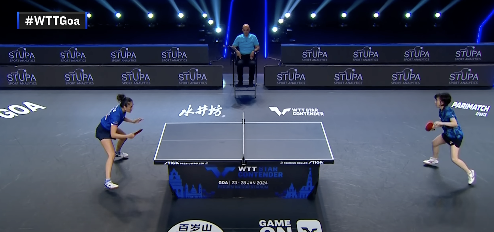
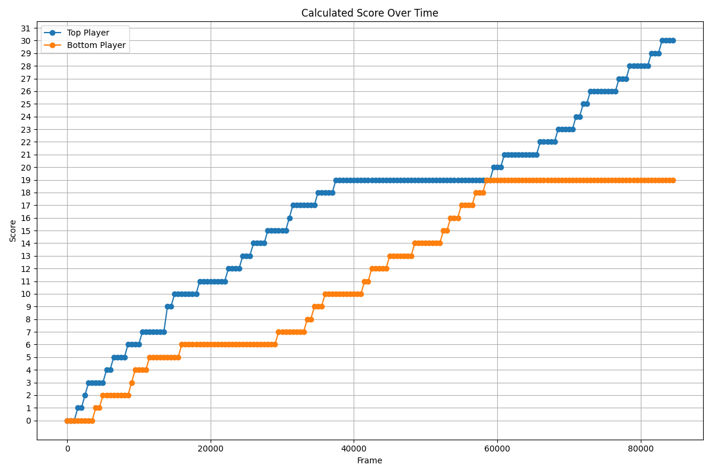

# Table Tennis Analyzer

    

A comprehensive computer vision project that automatically analyzes table tennis match footage to extract player positions, track skeletons, recognize the score, and generate insightful data visualizations. This project demonstrates a multi-faceted approach to video analysis, combining object detection, pose estimation, and optical character recognition (OCR).

---

## Project Showcase

Below are examples of the key outputs generated by the analysis pipeline.

<table style="border-collapse: collapse;">
  <tr>
    <td style="border: 1px solid gray; padding: 4px;">
        
    </td>
    <td style="border: 1px solid gray; padding: 4px; text-align: center;">
        <strong> Detection Video </strong><br>
        <em>
            (This is a placeholder image. You can see how the actual output video looks 
            <a href="https://drive.google.com/file/d/1X4gK3Ru_-UDZqz05n4jSecvODzqFvUf-/view?usp=drive_link">here</a>.)
        </em>
    </td>
  </tr>
  <tr>
    <td style="border: 1px solid gray; padding: 4px;">
        
    </td>
    <td style="border: 1px solid gray; padding: 4px; text-align: center;">Player Position Heatmap</td>
  </tr>
  <tr>
    <td style="border: 1px solid gray; padding: 4px;">
        
    </td>
    <td style="border: 1px solid gray; padding: 4px; text-align: center;">Score Progression Plot</td>
  </tr>
</table>


|                       Output Type                       | Description                                                                                                                                              |
| :-----------------------------------------------------: | -------------------------------------------------------------------------------------------------------------------------------------------------------- |
|                   **Detection Video**                   | The original video is processed to overlay player bounding boxes and skeletal keypoints, providing a visual representation of the tracking in real-time. |
|         | _(This is a placeholder image. The actual output is `output_with_detections.mp4`)_                                                                       |
|               **Player Position Heatmap**               | A heatmap is generated from the players' court positions throughout the match, revealing patterns of movement and strategic positioning.                 |
|  |                                                                                                                                                          |
|               **Score Progression Plot**                | A time-series plot illustrates the score changes for each player over the duration of the video, providing a clear narrative of the match's progression. |
|            |                                                                                                                                                          |

---

## Key Features

- **Modular Design**: The project is logically split into `app.py` for the main application flow and `analysis_utils.py` for all computer vision functions.
- **Player Detection & Pose Estimation**: Utilizes a YOLO11n-Pose model to detect players and estimate their pose structure in each frame.
- **Score Recognition**: A dual-strategy OCR system within `analysis_utils.py`:
  - **Primary Method**: Employs `easyocr` after applying a battery of advanced image preprocessing techniques (resizing, thresholding, edge enhancement, dilation) to maximize recognition accuracy.
  - **Fallback Method**: If OCR confidence is low, the system automatically switches to template matching against pre-defined digit images for enhanced reliability.
- **Frame Filtering**: The `is_valid_frame` function in `analysis_utils.py` identifies and processes only frames containing the two players and the referee.
- **Data Logging**: Systematically logs key data points to CSV files for further analysis:
  - `player_positions.csv`: Frame-by-frame `(x, y)` coordinates of each player.
  - `frame_scores.csv`: Scores at regular intervals throughout the video.
- **Automated Data Visualization**: Automatically generates a set of insightful visualizations upon completion of the analysis, including a player position heatmap and a score progression graph.

---

## Technical Stack

- **Core Language**: Python
- **Computer Vision**: OpenCV
- **Object Detection & Pose Estimation**: Ultralytics YOLO
- **Optical Character Recognition (OCR)**: EasyOCR
- **Data Manipulation & Numerics**: NumPy
- **Data Visualization**: Matplotlib, SciPy (for heatmap smoothing)

---

## Project Structure

The project is organized into two main Python files:

- `app.py`: This is the main entry point of the application. It handles video I/O, manages the main processing loop, orchestrates calls to the analysis functions, and saves the final outputs.
- `analysis_utils.py`: This file contains all the core computer vision logic. It includes functions for reading the score (`read_score`), validating frames (`is_valid_frame`), and generating the final plots (`generate_heatmap`, `generate_score_plot`).

---

## How It Works

The analysis pipeline is orchestrated by `app.py`:

1.  **Initialization**: `app.py` loads the `easyocr` and `YOLO` models and sets up video and CSV file handlers.
2.  **Frame-by-Frame Processing**: The script iterates through the video, performing the following on each frame:  
    a. **Frame Validation**: It calls `utils.is_valid_frame()` to check if the frame contains a valid scene (players and a referee).  
    b. **Pose Detection**: The YOLO model, run from `app.py`, identifies players and their skeletal keypoints.  
    c. **Data Extraction**: Player coordinates are extracted and stored.  
    d. **Drawing**: Bounding boxes and skeletons are drawn onto the frame for the output video.  
3.  **Periodic Score Reading**: Every 500 frames (10 seconds, for video with 50 fps), `app.py` calls `utils.read_score()`. This function crops the scoreboard, applies multiple preprocessing steps, and uses the best result from either `easyocr` or template matching. A sanity check in `app.py` ensures the score does not mistakenly decrease.
4.  **Finalization**: Once the video is fully processed, `app.py` calls the visualization functions from `analysis_utils.py` to:
    a. Generate and save the player position heatmap.
    b. Plot and save the score progression graph.
    c. Save the output video and close all file handlers.

---

## Setup and Installation

To run this project locally, follow these steps:

1.  **Clone the Repository**

    ```bash
    git clone <repository-url>
    cd Table_Tennis_Analyzer
    ```

2.  **Create and Activate a Virtual Environment**

    ```bash
    python3 -m venv .venv
    source .venv/bin/activate
    ```

3.  **Install Dependencies**

    ```bash
    pip install -r requirements.txt
    ```

4.  **Prepare Necessary Files**:
    - Download the input video from [here](https://drive.google.com/file/d/1Cl0THtGExrQwwfNQp7cK6ncYIQy09QJE/view?usp=sharing)
    - Place the input video in the root directory and name it `input.mp4`.
    - if the `yolo11n-pose.pt` model file it's not already present - download and place it in the root directory.

---

## Usage

Once the setup is complete, run the analysis from the root directory of the project:

```bash
python app.py
```

The script will process the `input.mp4` video and generate the following files:

- `output_with_detections.mp4`
- `player_position_heatmap.png`
- `calculatedScore.png`
- `player_positions.csv`
- `frame_scores.csv`

---

## Future Improvements

- **Performance Optimization**: Implement parallel processing for the frame analysis and OCR tasks to significantly speed up the analysis time on multi-core systems.
- **Advanced Analytics**: Expand the analysis to include metrics like player speed, distance covered, and rally length.
- **Ball Tracking**: Integrate a high-speed object tracking algorithm to follow the ball, enabling shot type analysis and rally statistics.
- **UI/Dashboard**: Develop a web-based dashboard using a framework like Flask or Dash to present the results in an interactive format.
